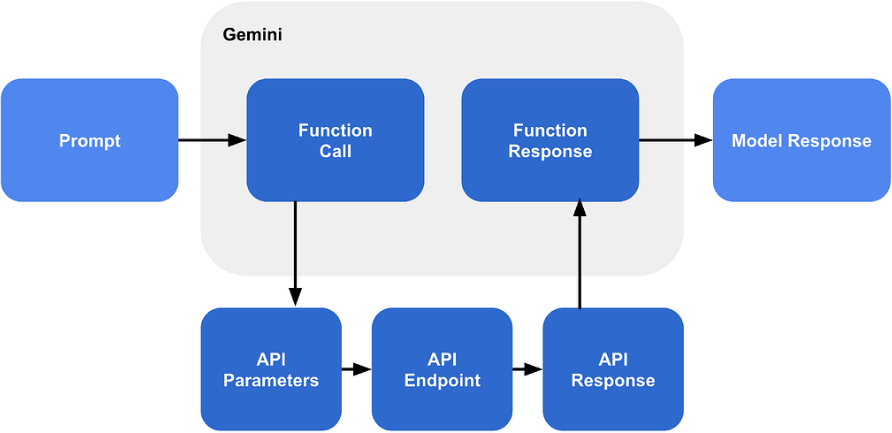

# AI Agent

This project uses a pre-trained LLM to create an AI agent that assists with coding tasks. Users can provide command-line instructions for the program to analyze a codebae, identify issues, and apply corrections.

**Project Demo:**

...

## Tech Stack

* **Frontend:** n/a
* **Backend:** Python, Google Gemini 2.5 Flash

## Project Structure

``` bash
ai-agent/
├── public/                     # Media assets
├── calculator/                 # Calculator app logic
│   ├── calculator.py           # Implements calculator class functionality
│   └── render.py               # Handles output rendering of expressions and results
├── functions/                  # Contains files with helper functions for AI agent to
├── .gitignore                  # Git ignore rules
├── .env                        # Environmental variables
├── main.py                     # Entry point for CLI agent
├── tests.py                    # Test scripts for call functions
├── pyproject.toml              # Project configuration and dependencies
├── uv.lock
├── README.md

# Before running this project locally, ensure you have the following installed:
- IDE (VS Code, PyCharm, etc.)
- Install Python 3.10+ version > visit python.org/downloads/

# Install dependencies
- uv project/package manager > docs.astral.sh/uv/getting-started/installation/
```

## Quick Start

This repo will later be, if not already, saved as a subfolder. Be sure to only clone relevant files. Then, do the following:

### Virtual Environment Setup

- All-in-one command to create project: `uv init project-name && cd project-name`
- Create virtual environment: `uv venv`
- Use uv's project environment and avoid pyenv/global mismatches: `uv add requests && uv run python main.py`
- Activate virtual environment: `source .venv/bin/activate`

### Environmental Variables

Create a `.env` file with the following contents:

```bash
GEMINI_API_KEY=""
AI_MODEL="gemini-2.5-flash"
MAX_CHAR_LIMIT=1000
SYSTEM_PROMPT=""
WORKING_DIR="./calculator"
MAX_ITERATIONS=20
```

### API Key Setup

- Create an API Key on [Google AI Studio](https://aistudio.google.com)
- Store API Key on `.env` file variable
- Add `.env` file to `.gitignore`

## Usage

...

## Development Roadmap



This project uses [function calling with Gemini API](https://ai.google.dev/gemini-api/docs/function-calling?example=meeting) to create structured outputs. The overall workflow is shown in the image above and, at a high level, is decribed below:

- **User Prompt:** The user provides a prompt used for a request. The AI agent limits this to the working directory specified in the `.env` file.
- **Function Calls:** The AI agent calls predefined functions to generate results.
- **Iteration:** The LLM  evaluates results and determines if additional function calls are necessary before creating a final response.
- **Final Output:** The AI agent returns a formatted summary. This can include metadeta and logs of functions called in addition to the final response.

## Credits and Contributing

[Boot.dev](https://www.boot.dev) provided the project requirements and guidance to complete this project. Modifications were made to follow function calling guidance from Google. The [Google Gen AI SDK](https://googleapis.github.io/python-genai/) for Python was used as a source of truth for development.
