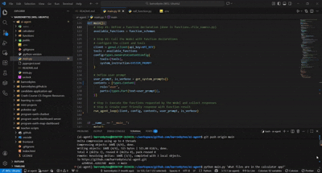
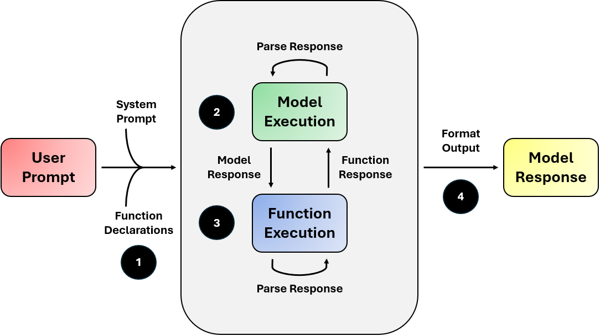
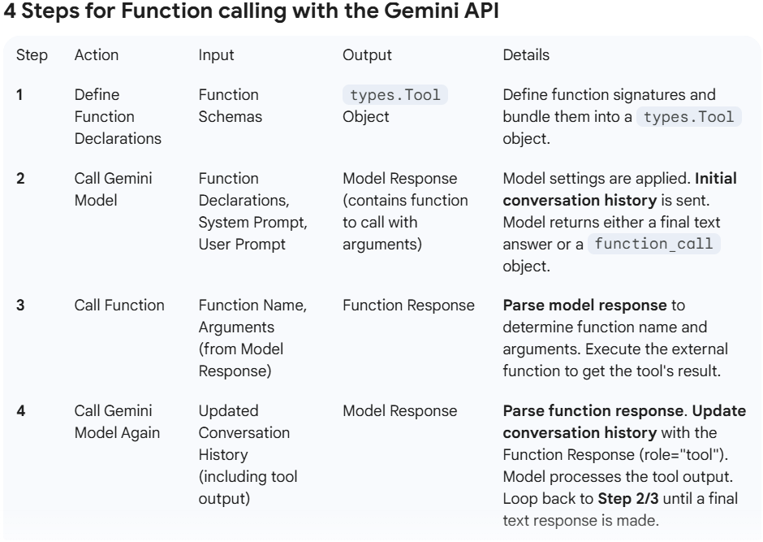

# AI Agent

This project uses a pre-trained LLM to create an AI agent that assists with coding tasks. Users can provide command-line instructions for the program to analyze a codebae, identify issues, and apply corrections.

**Project Demo:**



## Tech Stack

* **Frontend:** n/a
* **Backend:** Python, Google Gemini 2.5 Flash

## Project Structure

``` bash
ai-agent/
├── public/                     # Media assets
├── calculator/                 # Calculator app logic
│   ├── calculator.py           # Implements calculator class functionality
│   └── render.py               # Handles output rendering of expressions and results
├── functions/                  # Contains files with helper functions for AI agent to
├── .gitignore                  # Git ignore rules
├── .env                        # Environmental variables
├── main.py                     # Entry point for CLI agent
├── tests.py                    # Test scripts for call functions
├── pyproject.toml              # Project configuration and dependencies
├── uv.lock
├── README.md

# Before running this project locally, ensure you have the following installed:
- IDE (VS Code, PyCharm, etc.)
- Install Python 3.10+ version > visit python.org/downloads/

# Install dependencies
- uv project/package manager > docs.astral.sh/uv/getting-started/installation/
- Environmental variables > uv add python-dotenv==1.1.0
- Google Gemini API > uv add google-genai==1.12.1
```

## Quick Start

This repo will later be, if not already, saved as a subfolder. Be sure to only clone relevant files. Then, do the following:

### Virtual Environment Setup

- All-in-one command to create project: `uv init project-name && cd project-name`
- Create virtual environment: `uv venv`
- Use uv's project environment and avoid pyenv/global mismatches: `uv add requests && uv run python main.py`
- Activate virtual environment: `source .venv/bin/activate`

### Environmental Variables Setup

Create a `.env` file with the following contents:

```bash
GEMINI_API_KEY=""
AI_MODEL="gemini-2.5-flash"
MAX_CHAR_LIMIT=1000
SYSTEM_PROMPT=""
WORKING_DIR=""
MAX_ITERATIONS=20
```

### API Key Setup

- Create an API Key on [Google AI Studio](https://aistudio.google.com)
- Store API Key inside `.env` file on the `GEMINI_API_KEY` environmental variable
- Add `.env` file to `.gitignore`

## Usage

### Safeguards

The program grants read _and_ write privileges to a codebase. This can be dangerous! As a safegaurd, the program's actions are limited to a single directory. The user defines this constraint as the `WORKING_DIR` environmental variable found inside the `.env` file. Additionally, users can set values for `SYSTEM_PROMPT` to define AI agent behavior and `MAX_ITERATIONS` to prevent an infinite loop of function calls.

### User Prompts

After the virtual environment has been activated, users should use the following prompt format:

> `python main.py 'ENTER YOUR PROMPT HERE' --verbose`

The program will throw an error if a prompt is not entered after the program file name. Optionally, users can use a `--verbose` statement in the prompt for the response to report token input and output metadata.

## High-Level Overview



I created the diagram above to illustrate [function calling with Gemini API](https://ai.google.dev/gemini-api/docs/function-calling?example=meeting). The four numbers shown correspond with the article steps outlined, which are used throughout this project for developer documentation. The overall workflow follows this order and is expanded upon in a table below:

1. **Model Settings:** Model settings are set with combination of user prompt, system prompt, and function declarations. The user prompt is entered in the terminal. The system prompt is defined as an environmental variable.
2. **Call Model:** The Gemini model is executed. The model response may contain function calls along with arguments.
3. **Call Functions:** Functions are executed and the conversation history is updated.
4. **Model Response:** Steps 2 and 3 repeat. Final model response is formatted.



Safeguards taken throughout this project included: (1) safely storing API keys; (2) limiting read-write privileges to a single directory; (3) protecting against directory traversal; (4) limiting output to preserve tokens; (5) using timeout limits when running subprocesses; and (6) setting an iteration limit to avoid infite model + function execution loops. Error handling was used, but did not cover all edge cases.

## Credits and Contributing

[Boot.dev](https://www.boot.dev) provided the project requirements and guidance to complete this project. Modifications were made to follow [function calling guidance from Google](https://ai.google.dev/gemini-api/docs/function-calling?example=meeting). The [Google Gen AI SDK](https://googleapis.github.io/python-genai/) for Python was used as a source of truth for development. Contributions are welcome! Feel free to report any problems.
